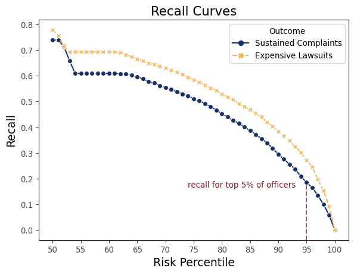

NYPD Replication
================

This repository contains code to recreate support analysis from our
research paper “Predicting Police Misconduct”. In our paper, we study
how well a data-driven machine learning system can predict serious
instances of police misconduct. The goal of such a system, often called
an early intervention system, is to identify officers who exhibit
warning signs of a serious negative event and intervene before with
support and services before that comes to pass. While our paper focuses
primarily on the Chicago Police Department (CPD), this repo uses public
data from the New York Police Department (NYPD) to recreate and
corroborate the main findings. Read below for a high-level description
of results, or [click here](#replication-instructions) to jump straight
to replication instructions. For more information, please see the paper
or contact us.

## Data / Methodology

We study this in NYPD using complaint records from New York City’s
Citizen Complaint Review Board (CCRB) (which investigates external
complaints against NYPD officers), lawsuit data recorded by NYC’s law
department, and a roster of NYPD officers. We constructed a panel
dataset where the features for each observation includes everything
known about an officer’s behavior up to and including year and the
outcomes include whether the officer was involved in any negative
outcomes in year T and T+1. We focus on prediction years from 2015-2019.
The final dataset has between 33,000 - 36,000 observations per year,
resulting in a total of 175,000 officer-year observations.

We constructed features (covariates) from an officer’s history of CCRB
complaints and lawsuits from the five years prior to the date of
prediction. An officer’s history of complaints is represented by the
total number of complaints, total number of complaints by type, number
of complaints by finding, and complaints by type and finding (eg “number
of sustained excessive force complaints”). An officer’s history of
lawsuits is represented by the total number of lawsuits, the number of
lawsuits by type, and the total monetary payouts in their lawsuits. Each
set of features were measured over the prior year, the prior two years,
and prior five years in order to allow the models to weight factors
differently based on how recently they occurred. In total, there are 117
features per observation.

We defined two outcomes in the NYPD data. The first outcome is whether
an officer has a sustained CCRB complaint during the outcome period,
which is analogous to the CPD on-duty misconduct outcome since the CCRB
only investigates complaints related to use of force, abuse of
authority, discourteous policing, and offensive language. This is a rare
outcome - only 3% to 4.5% of officers have a sustained complaint over
these two-year outcome periods. The second outcome is whether an officer
was named in a lawsuit whose payout is \$50,000 or greater during the
outcome period. For simplicity, we refer to these as expensive lawsuits.
This outcome is also rare - only 1-2% of officers are named in an
expensive lawsuit over these two-year outcome periods.

As a process note, most datasets have `tax_id` as the unique officer
identifier. The only exception is the payroll data which only has names.
When we merge that data into the rest of the data, we match on names and
drop any names that are duplicates. The result is that officers who have
conflict on first-and-last names will not have a known start date.
However, in those cases, we’re able to impute an officer’s start date
from the complaint data. Hence we’ll have a start date for any officers
whose name is unique or who’ve had a complaint at some point in their
career

## Results

Although the NYPD is more limited than the Chicago data in terms of the
types of prior datasets available (for example, the public NYPD dataset
does not have use of force data), we generally find the same conclusions
regarding the levels of predictability, the similar performance between
machine learning models and simple ranking policies, and the predictive
value of prior non-sustained complaints.

### Predictability of Machine Learning Models

We begin by documenting how well the machine learning models built on
NYPD data predict future sustained complaints and future expensive
lawsuits. The plots below show the recall curves of the machine learning
models for each outcome. The sustained complaints model shows a similar
level of predictability to the CPD models, with the top 5% of officers
by predicted risk accounting for 18.6% of all officers who have a
sustained complaint in the follow-up period. The ‘expensive lawsuit’
model shows a higher degree of predictability, with the top 5% of
officers by predicted risk accounting for nearly 30% of officers named
in an expensive lawsuit during the outcome period.

<figure>

<figcaption aria-hidden="true">Recall Plots</figcaption>
</figure>

### Comparison of Machine Learning Models and Simple Models

We next compared simple policies like ranking officers either by the
prior number of complaints or the prior number of lawsuits to machine
learning models. The first table below shows that rank-by-complaints
(RBC) captures nearly as many future sustained complaints as the machine
learning model that was trained to predict sustained complaints. The gap
in performance between ML and RBC is smaller in NYC than Chicago,
potentially due to the fact that there are fewer types of officer
behavior data in the public NYPD data. The rank-by-lawsuits (RBL)
policy, on the other hand, is significantly worse than both RBC and ML.

<table border="1" class="dataframe">
  <thead>
    <tr style="text-align: right;">
      <th></th>
      <th>method</th>
      <th>outcome</th>
      <th>recall</th>
      <th>true_positives</th>
    </tr>
  </thead>
  <tbody>
    <tr>
      <th>0</th>
      <td>rank by complaints</td>
      <td>sustained complaints</td>
      <td>0.176498</td>
      <td>193.00</td>
    </tr>
    <tr>
      <th>1</th>
      <td>rank by lawsuits</td>
      <td>sustained complaints</td>
      <td>0.112130</td>
      <td>120.04</td>
    </tr>
    <tr>
      <th>2</th>
      <td>machine learning</td>
      <td>sustained complaints</td>
      <td>0.185405</td>
      <td>202.80</td>
    </tr>
  </tbody>
</table>
<p>3 rows × 4 columns</p>

Machine Learning vs. Simple Policy - Sustained Complaints Outcome

The table below shows the machine learning model trained to predict
future expensive lawsuits is more accurate than either the RBC or RBL
policies, but both policies successfully identify a high-risk group of
officers. The top of 5% of officers by predicted lawsuit risk account
for 27.5% of all officers named in a future lawsuit (a rate that’s
nearly 6x times higher than the average officer) while the top 5% of
officers identified by RBL or RBC account for 21 or 22% of officers
named in an expensive lawsuit (which is roughly 4x higher than the
average officer).

<table border="1" class="dataframe">
  <thead>
    <tr style="text-align: right;">
      <th></th>
      <th>method</th>
      <th>outcome</th>
      <th>recall</th>
      <th>true_positives</th>
    </tr>
  </thead>
  <tbody>
    <tr>
      <th>0</th>
      <td>rank by complaints</td>
      <td>expensive lawsuits</td>
      <td>0.218382</td>
      <td>149.96</td>
    </tr>
    <tr>
      <th>1</th>
      <td>rank by lawsuits</td>
      <td>expensive lawsuits</td>
      <td>0.203485</td>
      <td>138.16</td>
    </tr>
    <tr>
      <th>2</th>
      <td>machine learning</td>
      <td>expensive lawsuits</td>
      <td>0.272327</td>
      <td>185.00</td>
    </tr>
  </tbody>
</table>
<p>3 rows × 4 columns</p>

Machine Learning vs. Simple Policy - Expensive Lawsuits Outcome

Simple ranking policies are fairly competitive with complex machine
learning models. This may be particularly important for small police
departments that might lack the sample size or resources to build a
complex predictive model.

### Predictive Value of Non-Sustained Complaints

We finally repeated the experiment of testing whether records of
non-sustained complaints have predictive value. Specifically, we
constructed two statistical models for each outcome. The “all
complaints” model used information derived from all complaints filed
against an officer in the five years prior to the date of prediction,
while the “only sustained complaints” model only had access to
information from complaints that were sustained.

This experiment shows that non-sustained complaints carry predictive
signals about the risk, which echoes our findings on the CPD data. When
flagging the top 5% of officers by predicted risk of a future sustained
complaint, the ‘All complaints’ model correctly flags 18.6% of officers
with a sustained complaint in the outcome period while the ‘Only
sustained complaints’ model flags 11.4% of officers with a sustained
complaint during the outcome period. This is a relative drop in accuracy
of 38%, and translates to 80 fewer correctly flagged officers per year.
Similarly, the machine learning model trained to predict future
expensive lawsuits suffers a relative drop in accuracy of 38% when
limiting prior features to only sustained complaints, which translates
to 56 fewer correctly flagged officers per year.

<table border="1" class="dataframe">
  <thead>
    <tr style="text-align: right;">
      <th></th>
      <th>method</th>
      <th>outcome</th>
      <th>recall</th>
      <th>true_positives</th>
    </tr>
  </thead>
  <tbody>
    <tr>
      <th>0</th>
      <td>Model with all prior complaints</td>
      <td>sustained complaints</td>
      <td>0.185540</td>
      <td>202.6</td>
    </tr>
    <tr>
      <th>1</th>
      <td>Model with only sustained complaints</td>
      <td>sustained complaints</td>
      <td>0.110553</td>
      <td>119.0</td>
    </tr>
  </tbody>
</table>
<p>2 rows × 4 columns</p>

Predictive Value of Sustained Complaints - Sustained Complaints Outcome

<table border="1" class="dataframe">
  <thead>
    <tr style="text-align: right;">
      <th></th>
      <th>method</th>
      <th>outcome</th>
      <th>recall</th>
      <th>true_positives</th>
    </tr>
  </thead>
  <tbody>
    <tr>
      <th>0</th>
      <td>Model with all prior complaints</td>
      <td>expensive lawsuits</td>
      <td>0.238848</td>
      <td>164.8</td>
    </tr>
    <tr>
      <th>1</th>
      <td>Model with only sustained complaints</td>
      <td>expensive lawsuits</td>
      <td>0.146118</td>
      <td>99.2</td>
    </tr>
  </tbody>
</table>
<p>2 rows × 4 columns</p>

Predictive Value of Sustained Complaints - Expensive Lawsuits Outcome

## Links to Public Data

All data used in this work is from publicly available sources. Those
sources are:

1.  NYPD officer roster: Used to generate a roster of active officers
    and get the date an officer left the NYPD. Data comes from [public
    CCRB
    data](https://data.cityofnewyork.us/Public-Safety/Civilian-Complaint-Review-Board-Police-Officers/2fir-qns4)
2.  Payroll data: Used to get the career start dates for officers. Data
    comes from [NYC’s legal aid
    society](https://github.com/the-legal-aid-society/LELU)
3.  Complaints and allegations: Used to generate features about an
    officer’s prior citizen complaints and outcomes about future citizen
    complaints. Data comes from [public CCRB
    data](https://data.cityofnewyork.us/Public-Safety/Civilian-Complaint-Review-Board-Complaints-Against/2mby-ccnw)
4.  Lawsuits: Used to generate features about an officer’s record of
    being named in past lawsuits and outcomes about being named in
    future lawsuits. Data comes from [NYC law
    department](https://www.nyc.gov/site/law/public-resources/nyc-administrative-code-7-114.page)

All data was accessed and stored in late November 2023.

## Replication Instructions

### Setting up the environment

The packages required to run this code exist in `environment.yaml`. To
set up and activate the conda environment, execute the following
commands:

``` bash
conda env create -f environment.yaml
conda activate oss_public_env
```

To add this conda environment as a kernel for the jupyter notebooks,
execute the following command:

``` bash
python -m ipykernel install --user --name oss_public_env --display-name "oss_public_env" 
```

### Replicating the Analysis

After setting up and activating the environment, go into the
`data_processing` and run the makefile using

``` bash
make
```

This will run the data processing steps in the following order:

1.  `clean_complaints_and_allegations`
2.  `clean_lawsuits`
3.  `clean_roster`
4.  `create_career_start_end_dates`
5.  `create_observations_main_table`
6.  `create_features_and_outcomes`
7.  `train_models`

For the last step, `train_models`, we offer a few command line arguments
that can be modified in the makefile.

1.  `mc_iters` - Specifies the number of iterations for model training.
    Run `python train_models.py --mc_iters 1` to minimize run time.
    Increasing `mc_iters` should slightly improve accuracy but does so
    at the expense of more computation time.

2.  `n_jobs` - Specifies the number of parallel processes to run while
    training the models. Run `python train_models.py --n_jobs 1` to
    specify a single process (no joblib parallelism will be used).

After training the models, you can reproduce the analysis by running the
jupyter notebook `NYPD_results.ipynb`.
