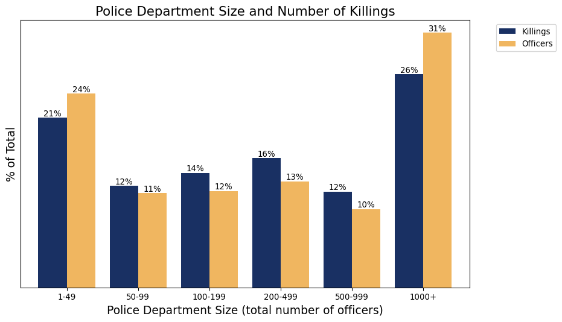

Police Violence and Agency Size
================
Greg StoddardDylan J. FitzpatrickJohn Greer

This repository contains code to recreate support analysis from our
research paper “Predicting Police Misconduct”. In our paper, we study
how well a data-driven machine learning system can predict serious
instances of police misconduct. The goal of such a system, often called
an early intervention system, is to identify officers who exhibit
warning signs of a serious negative event and intervene before with
support and services before that comes to pass. Read below for a
high-level description of results, or [click
here](#replication-instructions) to jump straight to replication
instructions. For more information, please see the paper or contact us.

## Analysis

Although our paper focuses on data from two large police departments -
the Chicago Police Department and the New York Police Department - our
further analysis suggests that police misconduct is not just a problem
for large departments. Using data from the Mapping Police Violence
project on people killed by police, we find 62% of police killings
involve departments with fewer than 500 officers, and 47% of killings
involve departments with fewer than 200 officers.

<table border="1" class="dataframe">
  <thead>
    <tr style="text-align: right;">
      <th></th>
      <th>Number of Officers</th>
      <th>Cumulative Share of Officers</th>
      <th>Cumulative Share of Police Killings</th>
    </tr>
  </thead>
  <tbody>
    <tr>
      <th>0</th>
      <td>1-99</td>
      <td>0.35</td>
      <td>0.33</td>
    </tr>
    <tr>
      <th>1</th>
      <td>100-199</td>
      <td>0.47</td>
      <td>0.47</td>
    </tr>
    <tr>
      <th>2</th>
      <td>200-499</td>
      <td>0.60</td>
      <td>0.62</td>
    </tr>
    <tr>
      <th>3</th>
      <td>500-999</td>
      <td>0.69</td>
      <td>0.74</td>
    </tr>
    <tr>
      <th>4</th>
      <td>1000+</td>
      <td>1.00</td>
      <td>1.00</td>
    </tr>
  </tbody>
</table>
<p>5 rows × 3 columns</p>

<figure>

<figcaption aria-hidden="true">Histogram of agency sizes</figcaption>
</figure>

<figure>

<figcaption aria-hidden="true">Distributions of Police Agency Sizes and
Proportion of Total Killings</figcaption>
</figure>

Despite the fact that large and small departments account for a roughly
proportionate share of police killings, smaller departments are much
less likely to use a tool like an early intervention system. As of 2016,
only 12.4% of departments used an EIS. By contrast, 80.5% of large
police departments (500+ sworn officers), had implemented an EIS in
2016.

One roadblock for smaller departments to implementing a data-driven
approach to early intervention is the resources necessary to construct
such a system. Fortunately, in our research paper, we find evidence that
smaller police departments might be able to get the benefits of an EIS
using a simple policy like flagging officers with the most prior
complaints in the past two years at a dramatically lower cost than
building a full-blown machine learning system.

As a caveat to the above analysis, we note that there are important
differences between `police misconduct` and police killings. Most
instances of police misconduct, even serious misconduct, do not result
in death. Similarly, not all police killings are the result of
misconduct. With these caveats in mind, we used the MPV data because we
otherwise lack national data on citizen complaints, use of force, or
lawsuits.

## Data & Methodology

We merged data from the Mapping Police Violence project
(https://mappingpoliceviolence.org/) with the 2016 Law Enforcement
Management and Administrative Statistics (LEMAS) survey to estimate the
share of police killings that are committed by small versus mid-size
versus large police departments. MPV constructs this dataset by
monitoring a stream of news articles produced by Google News and then
hand-verifying the details of a possible police killing. We merge this
data to the LEMAS survey by agency name. In the cases where the MPV data
lists multiple agencies as responsible, we attribute that event to each
listed agency (those events are rare and have no qualitative impact on
these findings). We limit our study to MPV-collected killings that
occurred between January 2013 and April 2023.

## Replication Instructions

### Setting up the Environment

The packages required to run this code exist in `environment.yaml`. To
set up and activate the conda environment, execute the following
commands:

``` bash
conda env create -f environment.yaml
conda activate oss_public_env
```

To add this conda environment as a kernel for the jupyter notebooks,
execute the following command:

``` bash
python -m ipykernel install --user --name oss_public_env --display-name "oss_public_env" 
```

### Reproducing the analysis

Go into the analysis directory and run the jupyter notebook
`police_size_and_agency_violence.ipynb`. Make sure to use
`oss_public_env` as the kernel.

## Data sources:

“Mapping Police Violence,” Campaign Zero, June 22, 2023,
https://mappingpoliceviolence.org/

United States Department of Justice. Office of Justice Programs. Bureau
of Justice Statistics. Law Enforcement Agency Roster (LEAR), 2016.
Inter-university Consortium for Political and Social Research
\[distributor\], 2017-04-05. https://doi.org/10.3886/ICPSR36697.v1
